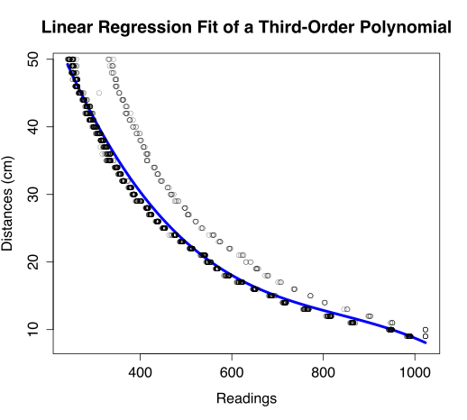

# Calibration Data and Analysis #

A dataset of 2100 data points was collected from robot #4 on 2014-03-06.

~~~~~~~~~~~~~~~~~~~~~~~~~~~~~~~~~~~~~~~~~~~~~~~~~~~~~~~~~~~~~~~~~~~~~~~~~~~~~~~
calib <- read.csv("calibration_data.csv", header = TRUE)
m <- lm(Distances ~ poly(Readings, 3, raw = TRUE), data = calib)
summary(m)
~~~~~~~~~~~~~~~~~~~~~~~~~~~~~~~~~~~~~~~~~~~~~~~~~~~~~~~~~~~~~~~~~~~~~~~~~~~~~~~

~~~~~~~~~~~~~~~~~~~~~~~~~~~~~~~~~~~~~~~~~~~~~~~~~~~~~~~~~~~~~~~~~~~~~~~~~~~~~~~
Call:
lm(formula = Distances ~ poly(Readings, 3, raw = TRUE), data = calib)

Residuals:
    Min      1Q  Median      3Q     Max 
-3.0520 -1.1882 -0.4838 -0.0494 13.7585 

Coefficients:
                                 Estimate Std. Error t value Pr(>|t|)    
(Intercept)                     1.005e+02  1.015e+00   98.98   <2e-16 ***
poly(Readings, 3, raw = TRUE)1 -2.811e-01  6.027e-03  -46.63   <2e-16 ***
poly(Readings, 3, raw = TRUE)2  3.148e-04  1.089e-05   28.90   <2e-16 ***
poly(Readings, 3, raw = TRUE)3 -1.254e-07  6.054e-09  -20.72   <2e-16 ***
---
Signif. codes:  0 ‘***’ 0.001 ‘**’ 0.01 ‘*’ 0.05 ‘.’ 0.1 ‘ ’ 1

Residual standard error: 2.293 on 2096 degrees of freedom
Multiple R-squared:  0.9643,	Adjusted R-squared:  0.9642 
F-statistic: 1.886e+04 on 3 and 2096 DF,  p-value: < 2.2e-16
~~~~~~~~~~~~~~~~~~~~~~~~~~~~~~~~~~~~~~~~~~~~~~~~~~~~~~~~~~~~~~~~~~~~~~~~~~~~~~~

~~~~~~~~~~~~~~~~~~~~~~~~~~~~~~~~~~~~~~~~~~~~~~~~~~~~~~~~~~~~~~~~~~~~~~~~~~~~~~~
xs <- seq(min(calib$Readings), max(calib$Readings))
ys <- predict(m, newdata = data.frame(Readings = xs))

plot(xs, ys, type = "l", xlab = "Readings", ylab = "Distances (cm)", lwd = 4, col = "blue")
points(calib$Readings, calib$Distances, lw = 0.3)
~~~~~~~~~~~~~~~~~~~~~~~~~~~~~~~~~~~~~~~~~~~~~~~~~~~~~~~~~~~~~~~~~~~~~~~~~~~~~~~

