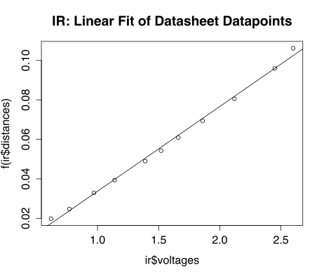
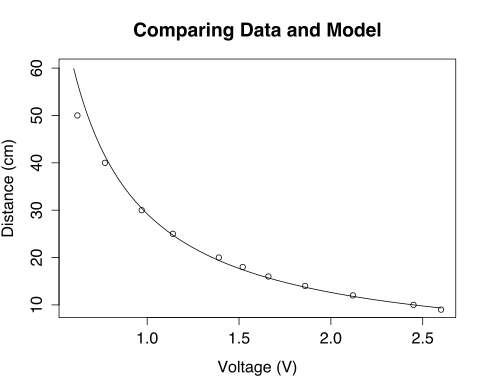

# Analysis of Datasheet Linear Fit #

The datapoints in `datasheet.csv` were extracted by eye-balling (white paper) datapoints from the second graph of the IR sensor's datasheet (see p. 9). That graph applies the inverse function $f(L) = {1 \over L + 0.42}$ in order to scale the distance axis and make the mapping to and from voltages and distances approximately linear.

In the below `R` script, we apply this same function to scale the `ir$distances` values (which is in this case, the response variable). We then fit a simple linear least squares regression line to the data.

~~~~~~~~~~~~~~~~~~~~~~~~~~~~~~~~~~~~~~~~~~~~~~~~~~~~~~~~~~~~~~~~~~~~~~~~~~~{.r}
ir <- read.csv("sensors/ir/datasheet.csv", header=T)

f <- function(L) {
    return (1 / (L + 0.42))
}

m <- lm(f(ir$distances) ~ ir$voltages)

plot(ir$voltages, f(ir$distances), main = "IR: Linear Fit of Datasheet Datapoints")
abline(m)
m
~~~~~~~~~~~~~~~~~~~~~~~~~~~~~~~~~~~~~~~~~~~~~~~~~~~~~~~~~~~~~~~~~~~~~~~~~~~~~~~

~~~~~~~~~~~~~~~~~~~~~~~~~~~~~~~~~~~~~~~~~~~~~~~~~~~~~~~~~~~~~~~~~~~~~~~~~~~~~~~
Call:
lm(formula = f(ir$distances) ~ ir$voltages)

Coefficients:
(Intercept)  ir$voltages  
  -0.009167     0.042911  
~~~~~~~~~~~~~~~~~~~~~~~~~~~~~~~~~~~~~~~~~~~~~~~~~~~~~~~~~~~~~~~~~~~~~~~~~~~~~~~

Clearly, a better scaling function could be found, but for now we can use the following function as an initial approximation for mapping from voltages to distances:

$$ m(v) = g(0.042911 v - 0.009167), $$

where $g$ is the inverse of $f$, that is,

$$ g(x) = {1 \over x} - 0.42 $$

~~~~~~~~~~~~~~~~~~~~~~~~~~~~~~~~~~~~~~~~~~~~~~~~~~~~~~~~~~~~~~~~~~~~~~~~~~~~~~~
g <- function(x) { (1 / x) - 0.42 }
m <- function(v) { g(0.042911 * v - 0.009167) }

xs <- seq(0.6, 2.6, length = 200)

plot(xs, m(xs), type="l", xlab="Voltage (V)", ylab="Distance (cm)")
points(ir$voltages, ir$distances)
title(main="Comparing Data and Model")
~~~~~~~~~~~~~~~~~~~~~~~~~~~~~~~~~~~~~~~~~~~~~~~~~~~~~~~~~~~~~~~~~~~~~~~~~~~~~~~

Lastly, we need to compensate for the fact that our inputs are going to be coming from the ADC. Before we use `m`, we need to convert our inputs from 10-bit unsigned binary numbers to voltages according to the ATmega128 datasheet. The key simplifying assumption is that the relationship is linear. According to p. 241 of that document,

$$ ADC = {V_{\text{in}} \cdot 1024 \over V_{\text{ref}}} $$

from which we can solve for $V_{\text{in}}$ in terms of $ADC$. So, a function which performs the conversion is

$$ V_{\text{in}}(d) = {2.56 \text{V} \over 1024} d. $$

Now we can compose these three functions to convert from the binary numbers coming from the ADC to a distance approximation. Let $c$ denote this conversion, i.e. 

$$ c(d) = m(V_{\text{in}}(d)) $$
$$ c(d) = {1 \over 0.042911 \cdot {2.56 \over 1024} \cdot d - 0.009167 } - 0.42 $$

~~~~~~~~~~~~~~~~~~~~~~~~~~~~~~~~~~~~~~~~~~~~~~~~~~~~~~~~~~~~~~~~~~~~~~~~~~~~~~~
v_in <- function(d) { (2.56 / 1024) * d }
c <- function(d) { m(v_in(d)) }
~~~~~~~~~~~~~~~~~~~~~~~~~~~~~~~~~~~~~~~~~~~~~~~~~~~~~~~~~~~~~~~~~~~~~~~~~~~~~~~
